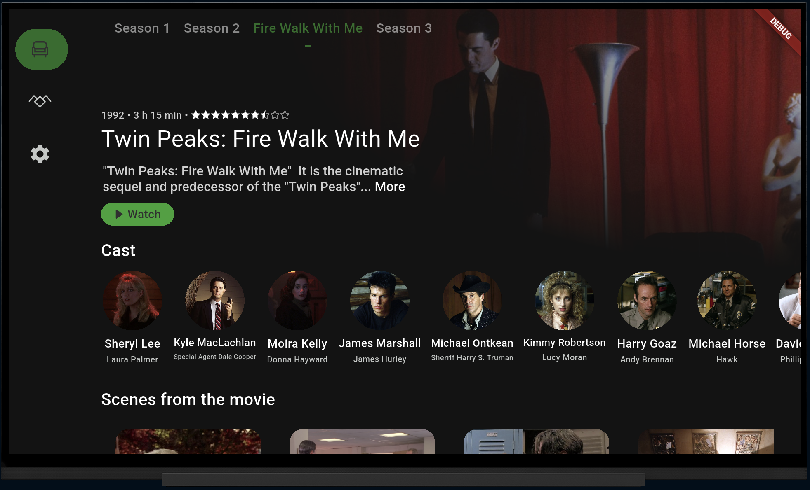
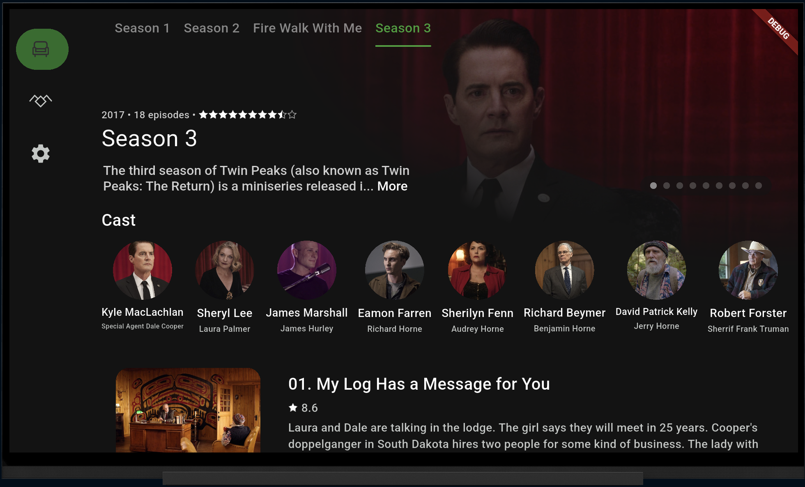
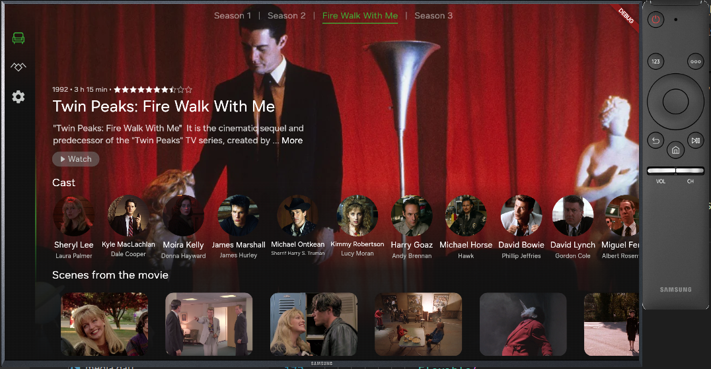
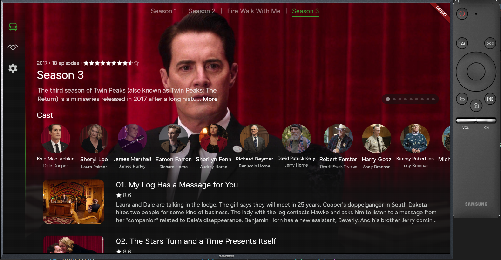
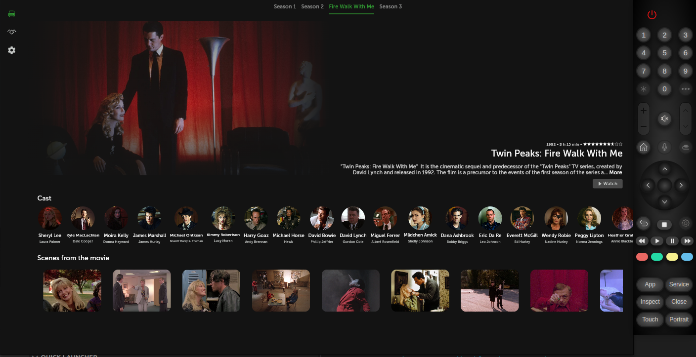
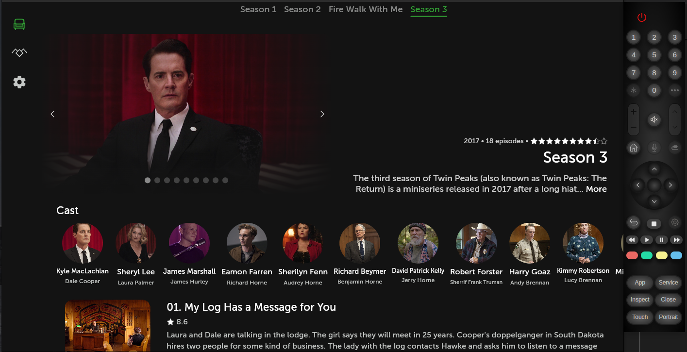

# Twin Peaks TV

Figma: https://www.figma.com/design/xjNQVReSDRd10FaggfSneU/Twin-Peaks-TV?node-id=0-1&p=f&t=1WGG98CEWJfpCunT-0
Server (to use, launch and update base url for flutter app): https://github.com/dinaraparanid/twin-peaks-tv-server

## Android TV

  
  

## Apple TV (tvOS)

  
  

## Samsung Tizen TV

  
  

## LG WebOS

  
  

